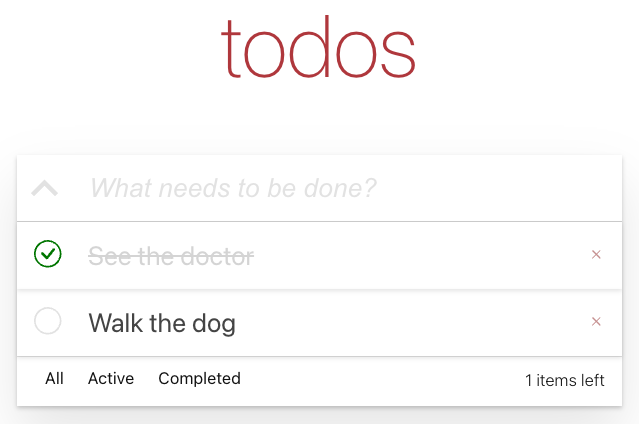

# About this project

This project is aboud building a classic to-do list application inspired by https://todomvc.com/. 

This project is built using React and limited to only the front-end. In other words, the data is not persisted and will be lost when the page is refreshed or when the application is restarted.

Before starting the project, you need to install the dependencies by running `npm install`.

## Start the project

To start the project, you can run `npm start`.